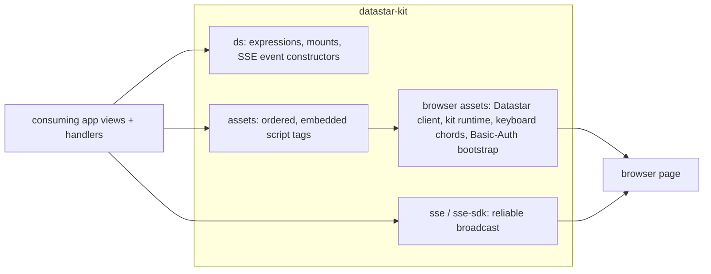

# High-Level Design: datastar-helpers (`datastar-kit`)

## Problem

Clojure + Datastar + http-kit apps let the server own all UI state and push finished HTML to the browser over SSE. The surface has sharp edges no Clojure compiler catches: a wrong signal expression, a misnamed SSE event, a synchronous fan-out, or a browser API that rejects a credentialed URL all compile cleanly and then fail silently in the browser or intermittently in production.

Each app that rediscovers one of these edges writes a local workaround. Local workarounds drift: the same fix exists in several repos at several levels of correctness, and a regression in one is invisible to the others.

## Approach

One shared library holds each pattern once. Every helper either makes the wrong call impossible by construction or makes it fail fast and loud at the call site, instead of silently on the wire.

### Server-side helpers

Signal-expression builders, spec-validated SSE event constructors, and reliable SSE broadcast (heartbeat, off-thread push, dead-connection reaping) in two flavors: raw-channel and Datastar-SDK.

### Browser assets owned by the kit

The vendored Datastar client, a small client runtime, the keyboard chord engine, and the Basic-Auth bootstrap. The kit owns their content, their load order, and their delivery into the page, so a consuming app has nothing to copy and nothing to order by hand.

## Target Users

- **App authors** building a server-is-the-game-loop Datastar app in Clojure, who want the reliability rules without re-deriving them.
- **Coding agents** working in those apps, whose training biases them toward SPA patterns and hand-rolled browser workarounds; the kit gives them a single paved call in place of each workaround.

## Goals

- A failure mode fixed once here stays fixed in every consuming app after a SHA bump.
- A consuming app carries no copy of any kit browser asset.
- Every browser workaround in the kit is covered by a test whose fake reproduces the real browser rule, including the failure the workaround exists for.

## Non-Goals

- Not a UI component library; apps own their markup and styling.
- Not a wrapper that hides Datastar; apps still write Datastar attributes and SSE events.
- Does not own application bindings: routes, actions, and key maps stay in the consuming app.
- Does not pin http-kit, Timbre, or the Datastar Clojure SDK; the consumer provides them.

## Tenets

- **Unrepresentable over detected.** When a mistake can be made impossible by construction or refused at the call site, prefer that to detecting it at runtime or documenting it.
- **Unconditional over probed.** A browser workaround installs on every page and is a no-op where it is not needed, rather than testing at load time whether it is needed. A probe exercises one call shape; callers use others.
- **The kit owns delivery.** Browser assets reach the page through kit functions that embed them and fix their order; convenience for an app that wants its own copy loses to one source of truth.
- **Share the engine, not the bindings.** Reusable state machines and sanitizers live here; what they are bound to lives in the app.

## System Design

Intent components:

| Component | Owns |
|---|---|
| `basic-auth-bootstrap` | Making browser URL APIs (Request, fetch, History) work on a page opened from a URL with embedded Basic-Auth credentials, and delivering that script first on the page. |
| `ds` | Signal helpers, persistent mounts, continuous controls, keydown builders, SSE event constructors. *(design not yet written)* |
| `sse`, `sse-sdk` | Reliable broadcast and targeted push. *(design not yet written)* |
| `assets` | Script-tag ordering and cache-busting hand-off. *(design not yet written)* |
| `keyboard-chords` | Two-key chord state machine. *(design not yet written)* |

## Key Design Decisions

- **Browser assets are embedded at compile time, not served from the dependency's resource directory.** Thin-JAR and container builds AOT-compile git dependencies and omit their resource directories, so a `src=` tag pointing at a kit asset 404s in production unless the app copies the file. Embedding removes the copy. Alternative considered: document a copy step per app; rejected because copies drift.
- **Consumers use `:local/root` in dev and a pinned git SHA in CI/deploy.** Instant local edits without giving up hermetic builds. The cost is that dev and prod diverge until the SHA is bumped; the README states the vigilance rule.

## Success Metrics

- No consuming app contains a file that duplicates a kit browser asset.
- A regression in a kit workaround fails a kit test before it reaches a consuming app.
- Falsification: a consuming app needs a local patch for a failure class the kit claims to own.

## References

- `README.md` — the sharp edges, with the failure each helper prevents.
- `docs/intent/` — design tree.
